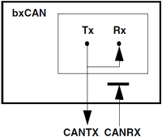
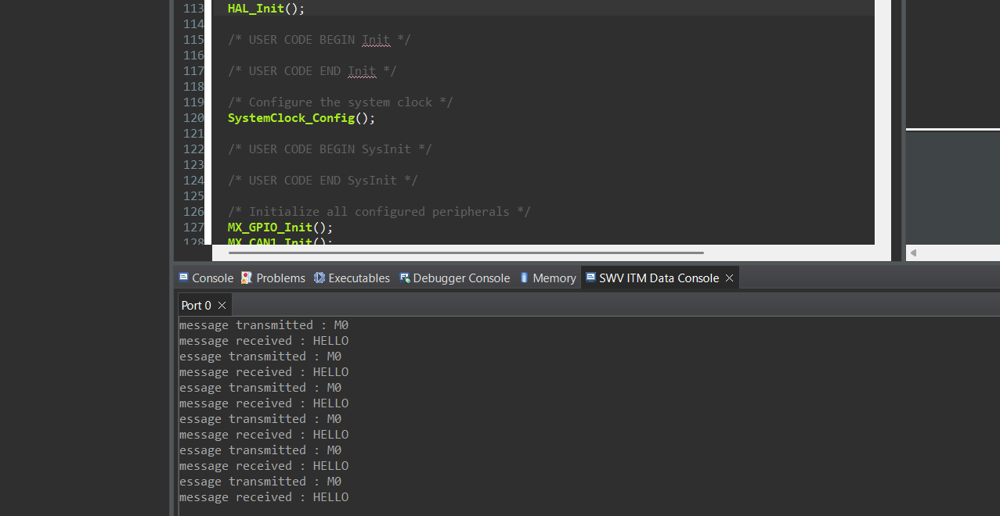
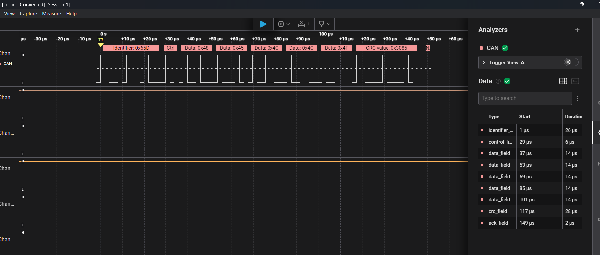

# STM32F407 CAN1 Loopback Mode Test 🚗📡

This project demonstrates how to configure and test the **CAN1** peripheral on an **STM32F407 Discovery** board (**STM32F407G-DISC1**) using **loopback mode**.  
In **loopback mode**, the CAN peripheral internally connects its transmit and receive paths, allowing you to validate CAN functionality **without external CAN transceivers** or another CAN device.

---

## 🖼 Project Overview



> **How it works:**
> 1. The firmware sends a CAN message `"HELLO"` using **CAN1 TX**.
> 2. The CAN peripheral internally loops the signal back to **CAN1 RX**.
> 3. The message is received through **FIFO0**.
> 4. A **SWV ITM data console** displays both transmitted and received messages.

---

## 📸 Screenshots & Results

### **1. SWV ITM Data Console Output**
When the project runs, the SWV ITM data console shows the transmitted and received messages:



---

### **2. Logic Analyzer Capture** *(Optional)*
Even though **loopback mode** bypasses the physical CAN layer, if you attach a logic analyzer to **PA12 (CAN1_TX)** and **PA11 (CAN1_RX)**, you'll still observe activity:



---

## 🛠 Hardware Requirements

| Component                   | Description |
|---------------------------|-------------|
| **Board**                | STM32F407G-DISC1 |
| **USB Cable**            | Power & flashing |
| **Logic Analyzer**       | *(Optional)* to visualize TX/RX |
| **CAN Transceiver**      | **Not required** (loopback mode) |

---

## ⚡ CAN1 Configuration

| Setting                | Value        |
|------------------------|-------------|
| **Peripheral**         | CAN1 |
| **Mode**               | **Loopback** |
| **Prescaler**          | 5 |
| **Time Segment 1**     | 8 TQ |
| **Time Segment 2**     | 1 TQ |
| **Sync Jump Width**    | 1 TQ |
| **Auto-Retransmission**| Enabled |
| **Tx Priority**        | Disabled |
| **Filter**             | Accepts **all messages** |

---

## 📜 Code Overview

### **1. CAN Initialization**
```c
hcan1.Instance = CAN1;
hcan1.Init.Prescaler = 5;
hcan1.Init.Mode = CAN_MODE_LOOPBACK;
hcan1.Init.SyncJumpWidth = CAN_SJW_1TQ;
hcan1.Init.TimeSeg1 = CAN_BS1_8TQ;
hcan1.Init.TimeSeg2 = CAN_BS2_1TQ;
hcan1.Init.AutoRetransmission = ENABLE;
HAL_CAN_Init(&hcan1);
```

### **2. CAN Filter Configuration**
Accept all incoming messages:

```c
CAN_FilterTypeDef can1_Filter_init;
can1_Filter_init.FilterActivation = ENABLE;
can1_Filter_init.FilterBank = 0;
can1_Filter_init.FilterFIFOAssignment = CAN_RX_FIFO0;
can1_Filter_init.FilterIdHigh = 0x0000;
can1_Filter_init.FilterIdLow = 0x0000;
can1_Filter_init.FilterMaskIdHigh = 0x0000;
can1_Filter_init.FilterMaskIdLow = 0x0000;
can1_Filter_init.FilterMode = CAN_FILTERMODE_IDMASK;
can1_Filter_init.FilterScale = CAN_FILTERSCALE_32BIT;
HAL_CAN_ConfigFilter(&hcan1, &can1_Filter_init);
```

### **3. Sending a CAN Message**
```c
CAN_TxHeaderTypeDef TxHeader;
uint32_t TxMailbox;
uint8_t message[5] = {'H','E','L','L','O'};

TxHeader.DLC = 5;
TxHeader.StdId = 0x65D;
TxHeader.IDE = CAN_ID_STD;
TxHeader.RTR = CAN_RTR_DATA;

HAL_CAN_AddTxMessage(&hcan1, &TxHeader, message, &TxMailbox);
```

### **4. Receiving CAN Message (Interrupt Mode)**
```c
void HAL_CAN_RxFifo0MsgPendingCallback(CAN_HandleTypeDef *hcan)
{
    CAN_RxHeaderTypeDef RxHeader;
    uint8_t rcvd_msg[5];
    HAL_CAN_GetRxMessage(&hcan1, CAN_RX_FIFO0, &RxHeader, rcvd_msg);
    printf("Message received: %s\r\n", rcvd_msg);
}
```

### **5. Transmission Complete Callback**
```c
void HAL_CAN_TxMailbox0CompleteCallback(CAN_HandleTypeDef *hcan)
{
    printf("Message transmitted : M0\r\n");
}
```

---

## 🖥 Example SWV ITM Console Output
```
Message transmitted : M0
Message received : HELLO
```

---

## 🚀 How to Run

1. Clone this repository or import into STM32CubeIDE.

2. Configure printf() to output via SWV ITM data console.

3. Build and flash the firmware to STM32F407G-DISC1.

4. Open the SWV ITM data console in your debugger.

5. Observe CAN transmission and reception messages.

---

## 📌 Notes

- Loopback mode does not require a physical CAN transceiver.

- To communicate with real CAN devices, set:
  ```c
  hcan1.Init.Mode = CAN_MODE_NORMAL;
  ```
  and connect a CAN transceiver (e.g., MCP2551 or SN65HVD230).
